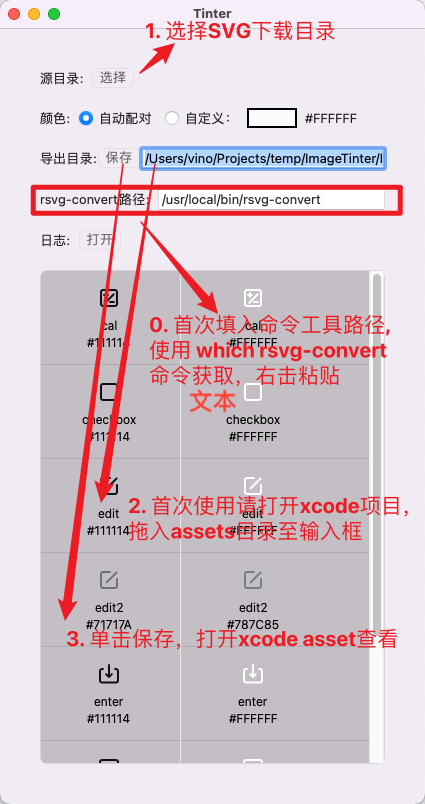

# ImageTinter
由`SVG`染色生成矢量`PDF`图片的工具。支持自动导入`Xcode Assets`并将染色图作为暗黑模式。


## 使用

**[首次使用]**
由于应用内部借助了命令行工具，因此使用前需安装命令行工具并配置其工作路径。

* 安装命令行工具

```
brew install librsvg
```
> 没有`brew`的请自行安装

* 获取命令行工具路径，拷贝备用

```
which rsvg-convert
```

* 修改工具路径
* 打开Xcode拖入Assets至输入框
> 以上仅在首次使用时需要操作

**[常规使用]**

* 下载`SVG`格式的图片，打开SVG图片目录（或拖拽目录至表格处）
* 点击保存，自动导入至`Xcode Assets`

> * 默认自动配色，不在配色表请检查或自选
> * **为确保唯一性，命名采用"设计名_尺寸_颜色", 如cal_24_111114为默认规范图标**





## 配色表
自定义配色表，建立一个名为`ImageTinterColors.json`的`JSON`文件，格式为{"白天色": "黑夜色"}，如下：
```json
{
    "#111114": "#ffffff"
}
```
> 同一个白天色的键值对会盖前者。

## 已知问题

* 为了执行命令行工具，已去除沙盒功能

## Bug

* [x] `arm64`系统第一张`SVG`加载报错。已规避，`SVGKit`问题。

### 计划
* [x] 添加Log输出
* [x] 同时导出源图的PDF
* [x] 命名增加尺寸
* [x] 保存到Assets
* [x] 拖拽优化